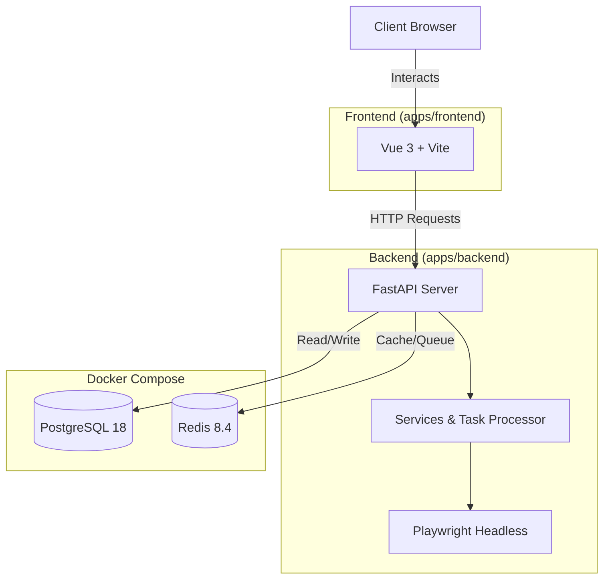

# Elegance

A full-stack application built with Vue 3 (Frontend) and FastAPI (Backend).

## Architecture



## Prerequisites

- **Python**: 3.13+
- **Node.js**: v20+ (v22 recommended)
- **pnpm**: Package manager for Node.js
- **Docker & Docker Compose**: For running the database and cache

## Getting Started

### 1. Start Infrastructure

Start PostgreSQL and Redis using Docker Compose:

```bash
docker compose up -d
```

### 2. Setup & Run Backend

Navigate to the backend directory and set up the Python environment:

```bash
cd apps/backend

# Create virtual environment
python3.13 -m venv venv
source venv/bin/activate  # On Windows: venv\Scripts\activate

# Install dependencies
pip install -r requirement.txt

# Install Playwright browsers
playwright install

# Run the server
# The server will run on http://localhost:8000
fastapi dev src/app.py
```

### 3. Setup & Run Frontend

Navigate to the frontend directory and start the development server:

```bash
cd apps/frontend

# Install dependencies
pnpm install

# Run development server
pnpm dev
```

The frontend will typically run on `http://localhost:5173` (check the terminal output).

## Project Structure

- `apps/backend`: FastAPI application source code, tests, and migration scripts.
- `apps/frontend`: Vue 3 application source code.
- `compose.yml`: Docker Compose configuration for local development infrastructure (Postgres, Redis).

## Load Testing

We use [k6](https://k6.io/) for load testing.

### Prerequisites

- Install k6: https://k6.io/docs/get-started/installation/

### Running Load Tests

The load test scripts are located in `loadtest/k6/`.

To run the buy transaction test:

```bash
k6 run loadtest/k6/testbuy.js
```

> **Note**: use your own JWT token in the script
